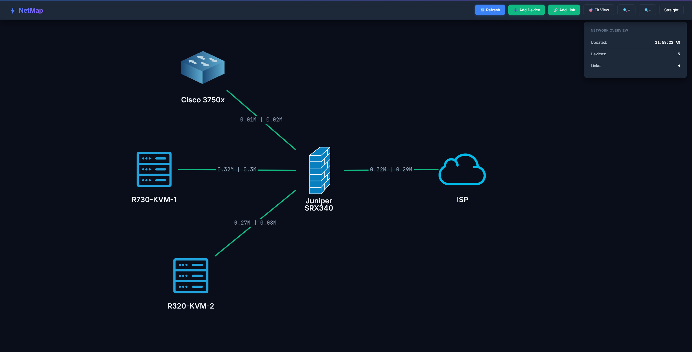

# NetMap 🗺️

> **⚠️ WORK IN PROGRESS - NOT PRODUCTION READY ⚠️**
> This is an active development project and should not be used in production environments without significant security hardening, testing, and validation.

A real-time network topology visualizer with live bandwidth monitoring powered by Prometheus and SNMP metrics. Built for network engineers and NOC teams to visualize and monitor their infrastructure with **instant WebSocket updates**.



## 🚀 Features

### Current Capabilities
- ✅ **Real-Time WebSocket Updates** - Instant topology changes across all clients (<100ms latency, no polling)
- ✅ **Live Bandwidth Monitoring** - Real-time metrics from Prometheus/SNMP with automatic updates
- ✅ **Interactive Topology** - Drag-and-drop network diagram with persistent node positioning
- ✅ **Professional Grid Background** - Dual-layer grid pattern (major/minor lines) for precise diagramming
- ✅ **Modern Glassmorphism UI** - Beautiful gradient header, custom fonts (Inter + JetBrains Mono), and professional design
- ✅ **Custom Device Icons** - Upload and edit PNG/JPG/SVG images with transparent backgrounds
- ✅ **Smart Icon Display** - Text labels positioned below custom icons for optimal readability
- ✅ **Dark Mode Optimized** - Professional dark theme designed for NOC environments
- ✅ **Curved/Straight Lines** - Toggle between curved bezier and straight connection lines
- ✅ **Full CRUD Operations** - Create, read, update, and delete devices and links via web UI
- ✅ **Icon Edit Support** - Change device icons anytime through the edit modal
- ✅ **Dummy Node Support** - Add external/ISP equipment without monitoring requirements
- ✅ **Vibrant Link Colors** - Green for normal traffic, yellow for moderate, red for high utilization
- ✅ **Enhanced Edge Connections** - Links properly connect to node boundaries
- ✅ **Bandwidth Visualization** - Real-time inbound/outbound traffic display on each link
- ✅ **Persistent Viewport** - Zoom and pan state preserved across page reloads
- ✅ **Auto-Reconnect** - WebSocket automatically reconnects on connection loss
- ✅ **Connection Status Indicator** - Visual feedback on WebSocket connection state
- ✅ **Cross-Platform Support** - Works on Ubuntu/Debian and AlmaLinux/CentOS/Rocky Linux
- ✅ **Systemd Service** - Production-ready service management with Daphne ASGI server
- ✅ **One-Command Install** - Automated installation script for easy deployment

### Tech Stack
- **Backend**: Django 6.0, Django REST Framework, Django Channels 4.0
- **ASGI Server**: Daphne 4.0 (WebSocket + HTTP support)
- **Frontend**: Cytoscape.js, Vanilla JavaScript, WebSocket API
- **Database**: SQLite (development) / PostgreSQL (production ready)
- **Monitoring**: Prometheus, SNMP Exporter
- **Deployment**: systemd service with Daphne
- **Network Protocols**: SNMP v2c/v3, WebSocket (WSS)

## 📋 Prerequisites

### Supported Operating Systems

**Debian-based:**
- Ubuntu 22.04 LTS or newer (tested on Ubuntu 24.04 LTS)
- Debian 11 or newer

**RHEL-based:**
- AlmaLinux 9 or newer
- CentOS Stream 9 or newer
- Rocky Linux 9 or newer
- Red Hat Enterprise Linux (RHEL) 9 or newer
- Fedora 36 or newer

### Requirements
- Python 3.12+ (3.10+ on RHEL-based systems)
- Prometheus server with SNMP Exporter
- Network devices with SNMP enabled
- sudo/root access for systemd service installation
- Nginx or similar reverse proxy (recommended for production with SSL/WebSocket support)

## 🔧 Installation

### Quick Install (Automated)

The installation script automatically detects your OS and installs the correct packages!

```bash
git clone https://github.com/Dubzyy/netmap.git
cd netmap
sudo ./install.sh
```

The install script will:
- **Auto-detect your operating system** (Ubuntu/Debian or AlmaLinux/CentOS/Rocky)
- Install system dependencies with the correct package manager (apt or dnf)
- Enable EPEL repository (on RHEL-based systems)
- Configure SELinux permissions (on RHEL-based systems)
- Create Python virtual environment
- Install Python packages (Django, Channels, Daphne, etc.)
- Run database migrations
- Create systemd service with Daphne ASGI server
- Configure firewall (ufw or firewalld)
- Start NetMap automatically

After installation, access NetMap at: `http://your-server-ip:8000`

### Platform-Specific Notes

<details>
<summary><b>Ubuntu / Debian Installation Notes</b></summary>

**Package Manager:** apt  
**Firewall:** ufw (if enabled)  
**Python Package:** python3-pip, python3-venv

```bash
# Standard installation
sudo ./install.sh
```

No special configuration needed - the script handles everything automatically.
</details>

<details>
<summary><b>AlmaLinux / CentOS / Rocky Linux Installation Notes</b></summary>

**Package Manager:** dnf  
**Firewall:** firewalld (automatically configured)  
**Python Package:** python3-pip, python3-devel, gcc, openssl-devel, libffi-devel  
**Repository:** EPEL (automatically enabled)

The installer automatically:
- Enables EPEL repository for additional packages
- Installs build dependencies (gcc, python3-devel)
- Configures SELinux permissions for Daphne
- Sets up firewalld rules (port 8000)
- Enables network connections for HTTP services

```bash
# Standard installation (same as Ubuntu)
sudo ./install.sh
```

**SELinux Configuration:**
The installer automatically configures SELinux to allow NetMap to run. If you encounter permission issues:

```bash
# Check SELinux status
getenforce

# View SELinux denials
sudo ausearch -m avc -ts recent

# If needed, allow HTTP network connections
sudo setsebool -P httpd_can_network_connect 1
```

**Firewalld Configuration:**
Port 8000 is automatically opened. To verify:

```bash
# Check firewall status
sudo firewall-cmd --list-ports

# Manually add port if needed
sudo firewall-cmd --permanent --add-port=8000/tcp
sudo firewall-cmd --reload
```
</details>

### Manual Installation

#### 1. Clone Repository
```bash
git clone https://github.com/Dubzyy/netmap.git
cd netmap
```

#### 2. Install System Dependencies

**Ubuntu/Debian:**
```bash
sudo apt update
sudo apt install -y python3 python3-pip python3-venv git
```

**AlmaLinux/CentOS/Rocky:**
```bash
# Enable EPEL
sudo dnf install -y epel-release

# Install dependencies
sudo dnf install -y python3 python3-pip python3-devel gcc git openssl-devel libffi-devel
```

#### 3. Backend Setup
```bash
cd backend

# Create virtual environment
python3 -m venv venv
source venv/bin/activate

# Install dependencies (includes Django Channels and Daphne)
pip install -r requirements.txt

# Run migrations
python manage.py migrate
```

#### 4. Configuration

Create your local settings file:
```bash
cp backend/netmap/settings_local.example.py backend/netmap/settings_local.py
nano backend/netmap/settings_local.py
```

Update with your configuration:
```python
# Local settings - DO NOT COMMIT THIS FILE

SECRET_KEY = 'your-unique-secret-key-here'
ALLOWED_HOSTS = ['your-server-ip', 'your-domain.com', 'localhost', '127.0.0.1']
PROMETHEUS_URL = 'http://your-prometheus-server:9090'
```

**Note**: The `settings_local.py` file is git-ignored and won't be committed to version control.

#### 5. Run Development Server
```bash
# For development with WebSocket support, use Daphne
daphne -b 0.0.0.0 -p 8000 netmap.asgi:application

# Alternative: Django development server (no WebSocket support)
python manage.py runserver 0.0.0.0:8000
```

Visit: `http://your-server:8000`

## 🐳 Production Deployment

### Systemd Service

The systemd service is automatically created by `install.sh` and uses Daphne ASGI server for WebSocket support. Manual management:

```bash
sudo systemctl start netmap    # Start service
sudo systemctl stop netmap     # Stop service
sudo systemctl restart netmap  # Restart service
sudo systemctl status netmap   # Check status
sudo journalctl -u netmap -f   # View logs
```

Service file location: `/etc/systemd/system/netmap.service`

**Example systemd service configuration:**
```ini
[Unit]
Description=NetMap Network Topology Visualizer with WebSocket Support
After=network.target

[Service]
Type=simple
User=netmap
Group=netmap
WorkingDirectory=/home/netmap/netmap/backend
Environment="PATH=/home/netmap/netmap/backend/venv/bin"
Environment="DJANGO_SETTINGS_MODULE=netmap.settings"
ExecStart=/home/netmap/netmap/backend/venv/bin/daphne -b 0.0.0.0 -p 8000 netmap.asgi:application
Restart=always
RestartSec=10

[Install]
WantedBy=multi-user.target
```

### Nginx Reverse Proxy with SSL and WebSocket Support

**Critical**: Nginx must be configured with WebSocket proxy headers for real-time updates to work.

Example Nginx configuration with HTTPS and WebSocket support:
```nginx
server {
    listen 443 ssl http2;
    server_name netmap.yourdomain.com;

    # SSL certificates (use certbot for Let's Encrypt)
    ssl_certificate /etc/letsencrypt/live/netmap.yourdomain.com/fullchain.pem;
    ssl_certificate_key /etc/letsencrypt/live/netmap.yourdomain.com/privkey.pem;

    # Security headers
    add_header X-Frame-Options "SAMEORIGIN" always;
    add_header X-Content-Type-Options "nosniff" always;
    add_header X-XSS-Protection "1; mode=block" always;
    add_header Strict-Transport-Security "max-age=31536000; includeSubDomains" always;

    location / {
        proxy_pass http://localhost:8000;
        proxy_http_version 1.1;
        
        # WebSocket support - REQUIRED for real-time updates
        proxy_set_header Upgrade $http_upgrade;
        proxy_set_header Connection "upgrade";
        
        # Standard proxy headers
        proxy_set_header Host $host;
        proxy_set_header X-Real-IP $remote_addr;
        proxy_set_header X-Forwarded-For $proxy_add_x_forwarded_for;
        proxy_set_header X-Forwarded-Proto $scheme;
        
        # WebSocket timeouts
        proxy_read_timeout 86400;
        proxy_send_timeout 86400;
    }
}

server {
    listen 80;
    server_name netmap.yourdomain.com;
    return 301 https://$host$request_uri;
}
```

Get free SSL certificate:
```bash
# Ubuntu/Debian
sudo apt install certbot python3-certbot-nginx
sudo certbot --nginx -d netmap.yourdomain.com

# AlmaLinux/CentOS/Rocky
sudo dnf install certbot python3-certbot-nginx
sudo certbot --nginx -d netmap.yourdomain.com
```

**After configuring Nginx:**
```bash
sudo nginx -t                  # Test configuration
sudo systemctl reload nginx    # Apply changes
```

### WebSocket Architecture

NetMap uses Django Channels with Daphne ASGI server for WebSocket support:

- **Channel Layer**: In-memory (development) / Redis (production scaling)
- **Consumer**: `TopologyConsumer` handles WebSocket connections
- **Broadcast**: All CRUD operations automatically broadcast to connected clients
- **Auto-Reconnect**: Client automatically reconnects every 5 seconds on disconnect
- **Fallback**: HTTP polling used if WebSocket unavailable

**Benefits over HTTP polling:**
- Update latency: 30s → <100ms
- Network requests: 120/hour/client → 1 persistent connection  
- Server load: High (constant polling) → Low (event-driven)
- Bandwidth: 10KB/30s → Updates only on changes

## 📊 Prometheus Configuration

NetMap requires Prometheus with SNMP Exporter to collect network metrics.

### Example Prometheus Scrape Config
```yaml
scrape_configs:
  - job_name: 'snmp'
    static_configs:
      - targets:
        - 192.168.1.1     # Your firewall
        - 192.168.1.2     # Your switch
        - 192.168.1.3     # Your router
    metrics_path: /snmp
    params:
      module: [if_mib]
    relabel_configs:
      - source_labels: [__address__]
        target_label: __param_target
      - source_labels: [__param_target]
        target_label: instance
      - target_label: __address__
        replacement: snmp-exporter:9116
```

### SNMP Exporter Configuration
NetMap uses standard IF-MIB metrics:
- `ifHCInOctets` - High-capacity inbound octets (64-bit counter)
- `ifHCOutOctets` - High-capacity outbound octets (64-bit counter)
- `ifHighSpeed` - Interface speed in Mbps
- `ifOperStatus` - Operational status (up/down)

Make sure your network devices have SNMP enabled and accessible from your Prometheus server.

## 🎨 Usage Guide

### Adding Devices
1. Click **"➕ Add Device"** in the toolbar
2. Enter device details:
   - **Name**: Display name (e.g., "Core Switch")
   - **Type**: Device category (Firewall, Switch, Router, Hypervisor, Server, ISP)
   - **IP Address**: Management IP address
   - **Prometheus Instance**: Must match your Prometheus target exactly (e.g., "192.168.1.1:161")
   - **Has Prometheus Metrics**: Uncheck for dummy nodes (ISP equipment, external devices)
3. Optionally upload a custom icon (PNG/JPG/SVG)
4. Click **"Create Device"**
5. **All connected clients see the change instantly via WebSocket!**

**Note**: For dummy nodes (external/ISP equipment), uncheck "Has Prometheus Metrics" - these will appear without bandwidth data.

### Adding Links
1. Click **"🔗 Add Link"** in the toolbar
2. Select source and target devices from dropdowns
3. Enter interface names exactly as they appear in your devices:
   - Juniper: `ae0`, `ge-0/0/0`, `xe-0/0/0`
   - Cisco: `GigabitEthernet0/1`, `TenGigabitEthernet1/0/1`
   - Linux: `eth0`, `bond0`, `ens192`
4. Set bandwidth capacity in Mbps (e.g., `1000` for 1 Gbps, `10000` for 10 Gbps)
5. Click **"Create Link"**
6. **Link appears instantly in all open browser tabs!**

### Editing Devices and Links
1. Click on any device or link to view details in the info panel
2. Click the **"✏️ Edit"** button
3. Modify any fields (except device type cannot change after creation)
4. Click **"Save Changes"**
5. **Changes broadcast to all users in real-time**

### Deleting Resources
1. Click on the device or link to select it
2. Click **"🗑️ Delete"** button in the info panel
3. Confirm deletion in the dialog
4. All connected links will be removed if you delete a device
5. **Deletion syncs instantly across all clients**

### Real-Time Updates

**WebSocket Features:**
- ✅ **Instant Topology Changes** - Create/edit/delete syncs across all clients immediately
- ✅ **Connection Indicator** - Refresh button opacity shows WebSocket status
- ✅ **Auto-Reconnect** - Automatically reconnects if connection drops
- ✅ **HTTP Fallback** - Uses standard HTTP if WebSocket unavailable

**How to verify WebSocket is working:**
1. Open NetMap in two browser tabs side-by-side
2. Add/edit/delete a device in one tab
3. Watch it appear/update/disappear instantly in the other tab (no refresh needed!)
4. Browser console (F12) shows: `WebSocket connected`

### Viewing Real-Time Metrics

**Link Metrics**: Click any link to see:
- ↓ Inbound bandwidth (Mbps)
- ↑ Outbound bandwidth (Mbps)  
- Total capacity (Mbps)
- Utilization percentage with color coding:
  - 🟢 **Green** (<50%): Normal operation
  - 🟡 **Yellow** (50-80%): Moderate load
  - 🔴 **Red** (>80%): High utilization, potential bottleneck

**Device Info**: Click any device to see:
- Device type and custom icon (if uploaded)
- IP address
- Monitoring status (monitored or dummy)

### UI Controls
- **🔄 Refresh**: Manually refresh topology and metrics (also indicates WebSocket status)
- **➕ Add Device**: Open device creation modal
- **🔗 Add Link**: Open link creation modal
- **🎯 Fit View**: Center and fit all nodes in viewport
- **🔍 Zoom In/Out**: Adjust zoom level
- **📐 Curved/Straight Lines**: Toggle between curved bezier and straight lines

### Keyboard & Mouse Controls
- **Drag nodes**: Click and drag to reposition (saves automatically)
- **Mouse wheel**: Zoom in/out
- **Click + Drag canvas**: Pan around the topology
- **Click node/link**: View details in info panel
- **Escape**: Deselect all

### Tips & Best Practices
- Arrange your topology logically (top-to-bottom or left-to-right flow)
- Use the grid background for precise alignment
- Use custom icons for important devices to make them stand out
- Name interfaces consistently for easier troubleshooting
- Set realistic bandwidth capacities for accurate utilization percentages
- Check link colors regularly - red links may indicate bottlenecks
- Use dummy nodes for ISP connections and external networks
- Open NetMap in multiple tabs/screens for NOC monitoring

## 🚧 Known Limitations

- **No Authentication** - Currently no user login system (use network-level security or reverse proxy auth)
- **Limited Input Validation** - Form inputs not fully sanitized
- **No Rate Limiting** - API endpoints unprotected from abuse
- **No TLS/SSL Built-in** - HTTP only (must use reverse proxy with SSL for HTTPS)
- **SQLite Default** - Works fine for small deployments, PostgreSQL recommended for production scale
- **In-Memory Channel Layer** - For multi-server deployments, use Redis channel layer
- **No Backup System** - Database backups not automated
- **Single Server** - No clustering or load balancing (can scale with Redis channels)
- **No Historical Data** - Only current metrics displayed, no time-series graphs
- **No Alerting** - No notifications for high utilization or down links

## 🔧 Troubleshooting

### Common Issues

<details>
<summary><b>WebSocket Connection Fails</b></summary>

**Symptoms:** Console shows `WebSocket error` or `Connection refused`

**Solutions:**
1. Verify Daphne is running: `sudo systemctl status netmap`
2. Check Nginx has WebSocket proxy headers (see Nginx config above)
3. View Daphne logs: `sudo journalctl -u netmap -f`
4. Test WebSocket directly:
   ```bash
   curl -i -N -H "Connection: Upgrade" -H "Upgrade: websocket" \
     -H "Sec-WebSocket-Version: 13" -H "Sec-WebSocket-Key: test" \
     http://localhost:8000/ws/topology/
   ```
</details>

<details>
<summary><b>Service Won't Start (RHEL-based)</b></summary>

**Symptoms:** `systemctl status netmap` shows failed

**Solutions:**
1. Check SELinux: `sudo ausearch -m avc -ts recent`
2. Enable network connections: `sudo setsebool -P httpd_can_network_connect 1`
3. Check file permissions: `ls -lZ /home/netmap/netmap/backend/venv/bin/daphne`
4. View detailed logs: `sudo journalctl -u netmap -n 50`
</details>

<details>
<summary><b>Firewall Blocking Connections</b></summary>

**Ubuntu/Debian (ufw):**
```bash
sudo ufw allow 8000/tcp
sudo ufw status
```

**AlmaLinux/CentOS/Rocky (firewalld):**
```bash
sudo firewall-cmd --permanent --add-port=8000/tcp
sudo firewall-cmd --reload
sudo firewall-cmd --list-ports
```
</details>

<details>
<summary><b>Python Package Installation Errors</b></summary>

**Solutions:**
```bash
cd ~/netmap/backend
source venv/bin/activate
pip install --upgrade pip
pip install -r requirements.txt
```

**On RHEL-based systems, ensure build tools are installed:**
```bash
sudo dnf install gcc python3-devel openssl-devel libffi-devel
```
</details>

## 📝 Roadmap

### High Priority
- [ ] User authentication and authorization system
- [ ] Comprehensive input validation and sanitization
- [ ] Unit and integration test coverage
- [ ] Enhanced error handling and logging
- [ ] API rate limiting and throttling
- [ ] API documentation (Swagger/OpenAPI)
- [ ] Redis channel layer for production scaling

### Medium Priority
- [ ] Docker containerization with docker-compose
- [ ] Historical bandwidth graphs (time-series visualization)
- [ ] Export topology as PNG/SVG image
- [ ] Bulk device import (CSV/JSON)
- [ ] Alerting system (email/Slack/webhook) for threshold violations
- [ ] Multiple topology views (save different network diagrams)
- [ ] Device grouping and hierarchical views

### Low Priority
- [ ] Multi-tenant support for MSPs
- [ ] Custom dashboard widgets
- [ ] Scheduled reports (PDF/email)
- [ ] Mobile app (React Native)
- [ ] Integration with other monitoring tools (LibreNMS, Zabbix)
- [ ] Advanced topology layouts (hierarchical, circular, force-directed)

### Completed ✅
- [x] **WebSocket real-time updates** - Instant topology synchronization across all clients
- [x] **Cross-platform support** - Ubuntu/Debian and AlmaLinux/CentOS/Rocky Linux
- [x] **Professional grid background** - Dual-layer grid for precise network diagramming
- [x] **Daphne ASGI server** - Production-ready WebSocket + HTTP server
- [x] **Django Channels integration** - Event-driven architecture for broadcasts
- [x] **Auto-reconnect logic** - Resilient WebSocket connections
- [x] **Connection status indicator** - Visual feedback on WebSocket state
- [x] Modern glassmorphism UI with gradient effects and custom typography
- [x] Custom device icon upload and edit functionality
- [x] Transparent icon backgrounds for clean visualization
- [x] Smart text positioning below custom icons
- [x] Vibrant green links for low/normal traffic visualization
- [x] Edit functionality for devices and links (including icon updates)
- [x] Curved/straight line toggle
- [x] Viewport persistence across sessions
- [x] Node position saving on drag
- [x] Systemd service for production
- [x] Color-coded link utilization
- [x] One-command installation script
- [x] Dummy node support
- [x] Full REST API with CRUD operations
- [x] Edge connections aligned to node boundaries

## 🤝 Contributing

Contributions are welcome! This project follows standard Git workflow:

1. Fork the repository
2. Create a feature branch (`git checkout -b feature/amazing-feature`)
3. Make your changes with clear, descriptive commits
4. Push to the branch (`git push origin feature/amazing-feature`)
5. Open a Pull Request with a detailed description

**Please ensure your code follows:**
- PEP 8 style guide for Python
- Consistent JavaScript formatting
- Include docstrings for functions
- Update README if adding features
- Test your changes before submitting

## 🐛 Bug Reports

Found a bug? Please [open an issue](https://github.com/Dubzyy/netmap/issues) with:

- **Clear description** of the problem
- **Steps to reproduce** the issue
- **Expected behavior** vs **actual behavior**
- **Screenshots** (if applicable)
- **Environment details**:
  - OS and version
  - Python version
  - Browser and version
  - NetMap version/commit
  - WebSocket connection status

## 📄 License

MIT License - See [LICENSE](LICENSE) file for details.

This project is free and open-source. You are free to use, modify, and distribute it as you see fit.

## 👤 Author

**Hunter** - NOC Engineer & Aspiring DevOps Engineer  
Network automation enthusiast and homelab operator

- 🌐 Portfolio: [portfolio.vrhost.org](https://portfolio.vrhost.org)
- 💼 GitHub: [@Dubzyy](https://github.com/Dubzyy)
- 🔗 LinkedIn: [Connect with me](https://www.linkedin.com/in/hunter-wilsonit/)

*Building tools to make network operations easier, one commit at a time.*

## 🙏 Acknowledgments

Built with these amazing open-source tools:

- **[Django](https://www.djangoproject.com/)** - High-level Python web framework
- **[Django REST Framework](https://www.django-rest-framework.org/)** - Powerful REST API toolkit
- **[Django Channels](https://channels.readthedocs.io/)** - WebSocket and async support for Django
- **[Daphne](https://github.com/django/daphne)** - ASGI server for Django Channels
- **[Cytoscape.js](https://js.cytoscape.org/)** - Graph theory visualization library
- **[Prometheus](https://prometheus.io/)** - Monitoring and alerting toolkit
- **[SNMP Exporter](https://github.com/prometheus/snmp_exporter)** - SNMP to Prometheus metrics

Inspired by enterprise monitoring tools like SolarWinds NPM, PRTG Network Monitor, and LibreNMS.

## 🔒 Security Notice

**⚠️ IMPORTANT: DO NOT USE IN PRODUCTION WITHOUT:**

- ✅ Implementing authentication and authorization
- ✅ Adding comprehensive input validation and sanitization
- ✅ Configuring SSL/TLS encryption (via reverse proxy)
- ✅ Setting up proper firewall rules (restrict to management network)
- ✅ Regular security audits and dependency updates
- ✅ Following OWASP security best practices
- ✅ Restricting network access to trusted IPs only
- ✅ Reviewing and securing the Django secret key
- ✅ Disabling DEBUG mode in production
- ✅ Securing WebSocket connections with WSS (SSL)

**This project is intended for internal use within trusted networks.** The author assumes no liability for security vulnerabilities, data loss, network outages, or any other issues arising from use of this software.

If you discover a security vulnerability, please email the details privately rather than opening a public issue.

## 📞 Support

Need help? Here's how to get support:

- 📖 **Documentation**: Read this README thoroughly
- 🐛 **Bug Reports**: [Open an issue](https://github.com/Dubzyy/netmap/issues)
- 💡 **Feature Requests**: [Submit an enhancement request](https://github.com/Dubzyy/netmap/issues)
- 💬 **Questions**: Check [existing issues](https://github.com/Dubzyy/netmap/issues) first
- 📧 **Direct Contact**: Available for collaboration or questions

**Response Time**: This is a personal project maintained in spare time. Response times may vary, but all issues are appreciated and will be addressed as time permits.

---

<div align="center">

**Development Status**: 🚧 Active Development  
**Version**: 0.3.0-alpha  
**Stability**: Pre-release (Not Production Ready)  
**Last Updated**: December 19, 2025

Made with ❤️ for the network engineering community

⭐ **Star this repo** if you find it useful!

</div>
